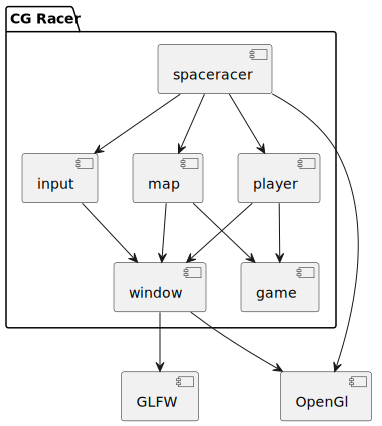

[](https://github.com/erzu12/cg_racer/actions/workflows/cmake.yml)
[](https://sonarcloud.io/summary/new_code?id=erzu12_cg_racer)
[](https://sonarcloud.io/summary/new_code?id=erzu12_cg_racer)
[](https://sonarcloud.io/summary/new_code?id=erzu12_cg_racer)
[](https://sonarcloud.io/summary/new_code?id=erzu12_cg_racer)


# CG Racer

CG Racer is a project created for the module Computer Graphics at HSLU.
It allows you to create a simple racecourse with Bezier curves and race on it.

In the module SWAT, it is being refactored.

## Build

Make sure you have `gcc`, `glfw`, and `OpenGL` installed.
Then you can run:

Configure
```
cmake -DTARGET_GROUP=release -B build
```

Build
```
cmake --build build
```

Run
```
./build/src/spaceracer
```

## Test

Configure
```
cmake -DTARGET_GROUP=test -B build
```

Build
```
cmake --build build
```

Run
```
cd build/test
```
```
ctest --output-on-failure
```

## Play 

Create a track with the red gizmos, then press `Tab` to play.

### Controls

- Main thruster: `space`
- Rotate: `←` `→`
- RCS thrusters: `W` `A` `S` `D`
- Back to edit mode: `Tab`

## Architecture

Spaceracer is the entrypoint and creates all necessary components, including the map to play on and the player itself. It also sets some OpenGL options not related to the window.
The Input module handles all non-player inputs, and Game stores the current state of the game. Widow is an abstraction layer for the GLFW windowing library, which creates a window and attaches an OpenGL context.


